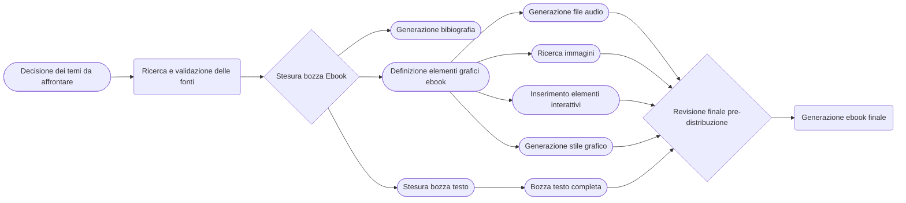
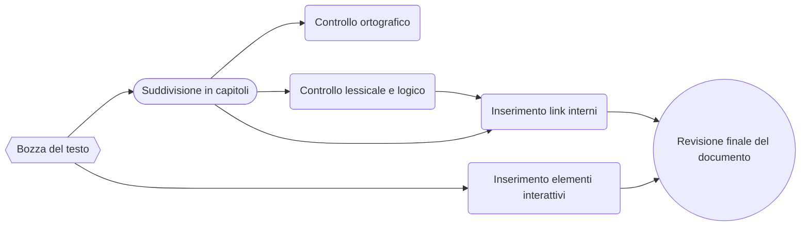
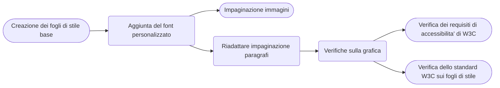
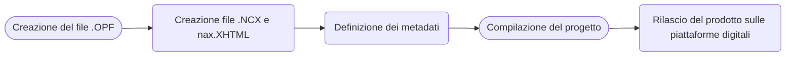

{width=100px height=100px}

# DSA: Manuale d'uso
Tecniche e consigli per lo sviluppo di contenuti accessibili

## Introduzione

Il progetto e' incentrato sulla realizzazione di un libro digitale da fornire ai genitori di bambini e ragazzi affetta di Disturbi specifici di apprendimento (DSA) che racchiude i consigli e le linee guida citati dai principali enti ed organizzazioni per la produzione di contenuti accessibili anche dalle persone piu' fragili. Il prodotto finale e' esso stesso accessibile alla lettura da parte delle persone affette da DSA e, per riuscire a garantire cio', si e' scelto di produrre un ebook in formato Epub3, cosi' da poter contenere immagini e audio che rendessero anche le parti piu' difficili leggibili da tutti.
L'ebook e' stato realizzato utilizzando Sigil per la gestione dei vari file; inoltre, il flusso documentale e' stato incentrato principalmente sulla ricerca di contenuti pertinenti al tema considerato e privi di copyright, sulla realizzazione di una struttura semplice e facilmente navigabile anche dalle persone fragili grazie all'applicazione diretta di tutte le guidelines citate dal libro stesso.

## Ideazione 

### Tema

Il prodotto editoriale dovra' riportare le tecniche principali che vengono impiegate ampiamente in ambito scolastico per la produzione dei materiali didattici, citando anche le fonti e gli enti che le sostengono, assieme ad alcuni esempi, cosi' da mostrare ai genitori sia degli esempi pratici da seguire sia per dimostrare la fattibilita' della produzione di contenuti accessibili e comprensibili dai loro figli affetti da fragilita'.
In linea con i consigli e le tecniche citate dalle organizzazioni preposte, il prodotto editoriale dovra' essere strutturato per includere anche strumenti complementare di supporto (immagini, video, file audio) per abbattere le barriere cognitive e permettere la comprensione degli esempi ed, eventualmente, dei contenuti dei paragrafi anche ai ragazzi fragili.

### Destinatari

I destinatari del prodotto editoriale, come gia' ampiamente descritto, sono i genitori dei bambini e dei ragazzi affetti da Disturbi specifici di apprendimento (DSA).

#### Personas

Per simulare gli utenti che utilizzeranno il prodotto finale sono stati creati due profili Personas distinti.

#### Scenari d'uso

***Scenario 1:*** Lettura sequenziale dell'ebook

1. Apertura dell'ebook;
2. Accesso all'indice per visualizzare l'organizzazione del documento e la lista dei capitoli e relativi sottocapitoli;
3. Accesso al primo capitolo e inizio lettura del documento;
4. Lettura di tutte le pagine di cui e' composto il documento fino alla fine.

***Scenario 2:*** Audiolettura del libro (lettura del contenuto del libro mediante i file audio presenti)
1. Apertura dell'ebook;
2. Accesso all'indice per visualizzare l'organizzazione del documento;
3. Selezione del capitolo che si vuole ascoltare;
4. Riproduzione dei singoli file audio presenti all'interno del capitolo.

### Modello di fruizione

Per soddisfare a pieno l'obiettivo di accessibilita', il prodotto editoriale deve verificare gli standard di accettazione di EPUB Accessibility 1.1 definiti dal W3C. Il formato scelto per l'ebook, ePub3, consente l'implementazione di una lettura non lineare, utile soprattutto ai lettori affetti da DSA che quindi, mediante l'inserimento di contenuti audio-visivi quali immagini, video e file audio, possono usufruire delle conoscenze contenute nel libro in maniera semplificata, abbattendo totalmente le barriere cognitive che renderebbero loro difficile la totale comprensione delle nozioni descritte all'interno dei capitoli.

### Canali di distribuzione

Il prodotto finale e' distribuito mediante le principali piattaforme online di ebook (Amazon Kindle, Apple Books, Google Play Books, Kobo, ecc.) in formato .epub per essere facilmente leggibile da tutti gli ereader; inoltre, grazie all'uso di specifiche applicazioni per la lettura di ebook, si ha la possibilita' di consultare agilmente e senza alcun tipo di problema di compatibilita' il prodotto editoriale anche attraverso smartphone.
Nel caso in cui gli utenti non dovessero disporre di questi dispositivi, grazie all'uso del formato scelto, il prodotto e' consultabile anche mediante computer attraverso i programmi opportuni (Calibre, applicazioni di ebook reader online, ecc.).
Il prodotto finale e' stato realizzato rispettando tutte le principali linee guida pubblicate dagli enti e dalle organizzazioni riconosciute nel campo dei DSA, quindi cerca di ridurre al minimo l'uso di grafiche complesse e prediligere la semplicita':

* il font utilizzato e' adatto alla lettura da parte di persone affette da dislessia;
* le frasi sono, per quanto possibile, brevi e prive di costrutti sintattici complessi;
* i capitoli sono esaurienti e presentano pochi sottocapitoli ciascuno, per semplificare ancora di piu' la struttura del documento:
* il lessico utilizzato e' diretto e conviviale, per non appesantire troppo i paragrafi e rendere la lettura pesante da parte degli utenti finali.

## Processo di Produzione

### Acquisizione dei contenuti
Le fonti utilizzate per la scrittura del prodotto editoriale sono principalmente provenienti da organizzazioni, enti incentrati sul tema e fonti ufficiali quali ministeri (es. MIUR) per garantire la massima correttezza del contenuto dal punto di vista delle conoscenze.
I documenti utilizzati sono spesso diffusi come linee guida in maniera pubblica e quindi sono privi di copyright; nel caso in cui fossero coperte da copyright, essendo che il prodotto che stiamo andando a realizzare e' per scopi didattici ed educativi senza scopo di lucro, tale uso ricade all'interno del cosiddetto Fair Use.
Essendo che sono presenti molti documenti e ricerche relative all'argomento, le fonti saranno quasi totalmente in italiano; nel caso in cui venissero usati documenti in lingua inlgese, utilizzerei degli strumenti di traduzione affidabili (es. DeepL, Google Traduttore solo con frasi verificate) per garantire il minimo errore di conversione.
Le immagini presenti all'interno del prodotto finale vengono scelte in base al copyright, facendo in modo di utilizzare solamente file privi di copyright.
Per concludere, i file audio contenenti le trascrizioni testuali vengono generati automaticamente mediante l'uso di opportuni tool.

### Gestione documentale

Descrivere il *flusso di gestione documentale* definito per il progetto. Ad esempio, (i) la raccolta o produzione dei contenuti, (ii) la valutazione dei diritti, (iii) la trasformazione dei formati, (iv) la strutturazione dei contenuti, (v) l'applicazione dello stile grafico, (vi) la generazione dei metadati, (vii) la distribuzione dei contenuti. Nella descrizione del flusso considerare le  fasi di revisione, controllo e approvazione che possono richiedere le diverse fasi.

#### Raccolta dei contenuti e definizione struttura prodotto

#### Strutturazione dei contenuti

#### Definizione e applicazione dello stile grafico

#### Produzione ebook e distribuzione

### Tecnologie adottate

Descrivere le tecnologie addottate nelle diverse fasi e discuterne il contributo in termini di raggiungimento degli obiettivi descritti negli scenari d'uso.

| Tecnologia               | Funzionalita' d'uso all'interno del progetto                                                                                                                                                                                                                                            |
|--------------------------|-----------------------------------------------------------------------------------------------------------------------------------------------------------------------------------------------------------------------------------------------------------------------------------------|
| Sigil                    | Creazione dei file necessari per la generazione dell'ePub.  E' un software che contiene anche plugin ed altre funzionalita' per la definizione dei metadati; consente di definire i file XHTML per strutturare i vari capitoli, ed i file CSS per la definzione dello stile dell'ebook. |
| Markdown Table Generator | Strumento online per semplificare la generazione delle tabelle in Markdown necessarie per la relazione                                                                                                                                                                                  |
| Visual Paradigm Online   | Strumento online per la definizione degli schemi AS_IS e TO_BE implementati nella relazione                                                                                                                                                                                             |
| XHTML                    | Formato per la definizione della struttura del prodotto finale                                                                                                                                                                                                                          |
| CSS                      | Usato per la definizione dello stile dell'ebook                                                                                                                                                                                                                                         |
| Luvvoice                 | Strumento software per generare i file audio a partire dal testo                                                                                                                                                                                                                        |
| Figma                    | Strumento software usato per la definizione dei profili Personas                                                                                                                                                                                                                        |
| ACE                      | Tool da linea di comando per verificare l'accessibilita' dell'ebook rispetto agli standard WCAG e ePub Accessibility 1.1                                                                                                                                                                |
| Github                   | Software usato per gestire il versioning del progetto e per gestire il flusso di produzione                                                                                                                                                                                             |
| Mermaid                  | Software usato per la creazione dei diagrammi di flusso presenti all'interno della relazione                                                                                                                                                                                            |
| Apple Libri              | Software utilizzato per la visualizzazione finale del progetto e per simulare l'apertura dell'epub da parte degli utenti finali                                                                                                                                                         |
| Visual Studio Code       | IDE utilizzato in maniera complementare a Sigil per l'editing dei documenti XHTML e CSS                                                                                                                                                                                                 |

### Esecuzione del flusso
Accedendo al seguente [repository](https://github.com/Nickbarbieri1/Editoria-Digitale-Relazione-2024-2025.git) si possono consultare tutti i file realizzati per la creazione dell'intero progetto e della relazione.
## Valutazione dei risultati raggiunti

### Valutazione del flusso di produzione

Il prodotto finale che e' stato realizzato, a causa della grande frammentazione delle fonti che sono state consultate per la sua realizzazione, ha qualche problema dal punto di vista dell'uniformita'; questa frammentazione, che e' stata adottata anche nell'uso degli strumenti software per la produzione sia del prodotto digitale che di questa relazione, ha permesso di ridurre al minimo gli errori sintatti, ed ha permesso anche di accelerare il flusso di produzione. 
Il software che e' stato utilizzato per la produzione dell'ebook, Sigil, e' dotato di varie componenti per il controllo automatico degli errori all'interno della struttura del documento e delle pagine HTML che lo compongono, il che ha permesso di ridurre al minimo lo spreco di tempo; purtroppo, pero', all'interno dell'editor incluso nel software non e' presente la lingua italiana, il che mi ha portato ad utilizzare un ambiente esterno per velocizzare questo processo (e' stato utilizzato l'IDE Visual Studio Code). 
Il formato che si ha scelto di adottare, ovvero ePub3, consente di essere supportato su tutti i canali di distribuzione digitali, sia quelli ufficiali (ebook store), sia quelli non ufficiali (social, Internet, ecc.); inoltre, l'utilizzo di un formato standard consente la fruizione del prodotto a tutti gli utenti dotati di un dispositivo o una applicazione di lettura degli e-book.

### Confronto con lo stato dell'arte

#### Schema ASIS

#### Schema TOBE

A primo impatto sembrerebbero non esserci grandi differenze tra i due schemi, ma prestando maggiore attenzione al contenuto dei vari blocchi viene evidenziato come, nello schema TOBE, siano stati automatizzati i passi relativi alla verifica dei vincoli relativi ai fogli di stile ed ai requisiti di accessibilita' dell'ePub3; inoltre, sono stati automatizzati anche i passi di modifica di eventuali errori all'interno del contenuto o del foglio di stile, mediante l'uso di software preposti a questi compiti.

### Limiti emersi

Il principale limite che ho riscontrato nella produzione del prodotto editoriale e' stata la ricerca di programmi online che fossero contemporaneamente gratuiti ed efficaci: e' risultato difficile riuscire a trovare uno strumento valido per la generazione dei file audio a partire dalla descrizione testuale che avesse una pronuncia soddisfacente, con la possibilita' di modificare e selezionare la voce piu' adatta alla comprensione e che rispettasse le pause e gli accenti tonici delle parole utilizzate all'interno dei paragrafi. 
Inoltre, un altro grande limite con cui mi sono scontrato e' l'impossibilita', per gli utenti utilizzatori di computer Apple, di integrare all'interno di Sigil il plugin ACE per il controllo degli standard di accessibilita' dell'ebook; per le altre piattaforme esiste un plugin funzionante che integra il tool ACE da linea di comando all'interno della UI di Sigil, ma tale plugin non risulta funzionare per gli utilizzatori di Mac, il che ha reso il processo di verifica dell'ebook piu' lungo ed anche meno manutenibile. 
Infine, l'interfaccia grafica, ormai obsoleta, di Sigil ha richiesto un tempo maggiore nello sviluppo e nella comprensione delle funzioni messe a disposizione dall'applicazione, anche a causa di una documentazione scarsa o molto vecchia e ormai obsoleta.

## Conclusioni

Il prodotto editoriale finale risulta essere un po' scarno nella quantita' dei contenuti, e cita le principali tecniche mostrando qualche piccolo esempio, ma senza dilungarsi eccessivamente nella spiegazione delle basi pedagogiche e degli studi scientifici che hanno portato gli enti a proporre quegli strumenti didattici. 
Anche la forma grafica risulta essere abbastanza abbozzata, ma comunque efficace e sufficiente alla realizzazione di una prima versione del prodotto. 
Tutti gli scenari d'uso descritti all'interno della consegna risultano essere soddisfatti, per cui il lavoro si puo' ritenere possibile e completo per le richieste; l'uso di strumenti piu' avanzati, magari a pagamento, permetterebbe uno sviluppo piu' lineare, omogeneo e rapido dei contenuti, permettendo di arrivare a produrre un prodotto finale molto piu' professionale di quello ottenuto ora, ma ad un costo molto maggiore.

## Bibliografia e sitografia

Elencare i riferimenti bibliografici e risorse online che hanno maggiormente contribuito alla realizzazione del progetto. Ad esempio [@sechi2010,@pantieri2021,@ceravolo2023,@pixabay,@w3c-css-verifier,@md-table-generator,@epub-accessibility,@daisy,@pexels,@luvvoice,@mermaid,@figma]
